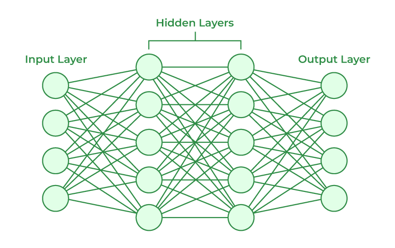

# Machine Learning Basics 
## Artificial Intelligence vs. Machine Learning vs. Deep Learning 
Machine Learning (ML) is a subset of Artificial Intelligence (AI) and Deep Learning (DL) is a subset of ML. 
### Artificial Intelligence 
* Branch of Computer Science concerned with building intelligent machines 
* Intelligent machines make decisions on their own (like a Tesla)
### Machine Learning 
* A technique that implements AI to learn from the data by themselves without being explicitly programmed. 
### Deep Learning 
* A subfield of ML that uses Artificial Neural Networks to learn from the data. 
* Artificial Neural Networks --> Mathematical models thare are connected like the neurons in our brain

## Types of Machine Learning 
### Supervised Learning 
* The ML algorithm learns from labelled data. 
* Ex: Feed labeled apple and mango images. Given an image of an apple or a mango, the algorithm will determine which it is. 
### Unsupervised Learning 
* No labels
* Ex: A image of apples and mangoes is given. The algorithm will group the items in the image into Group 1 and Group 2. If you give it an image of an apple or mango, it will tell you which group it belongs to. 
### Reinforcement Learning 
* An area of ML concerned with how intelligent agents take action in an environment to maximize its rewards. 
    * Example:
    * Environment --> Chess baord 
    * Agent --> Computer 
    * Action --> Making a move 
    * Reward --> Winning the chess game 
    * If the machine makes a good move, it's rewarded. Using this, the machine learns how to make the right chess moves. 
## Types of Supervised Learning
### Classification 
* About predicting a class or discrete values (male or female, true or false)
* Important Algorithms
    * Decision Tree Classification
    * Random Forest Classification 
    * K-nearest neighbor 
### Regression 
* About predicting a quantity or continuous value (salary, age, price, etc.)
* Ex: Feeding in rainfall data at different temperatures to determine rainfall in cm for some temperature that data has not been provided for
* Important Algorithms
    * Logistic Regression
    * Polynomial Regression 
    * Support Vector Machines 
## Types of Unsupervised Learning 
